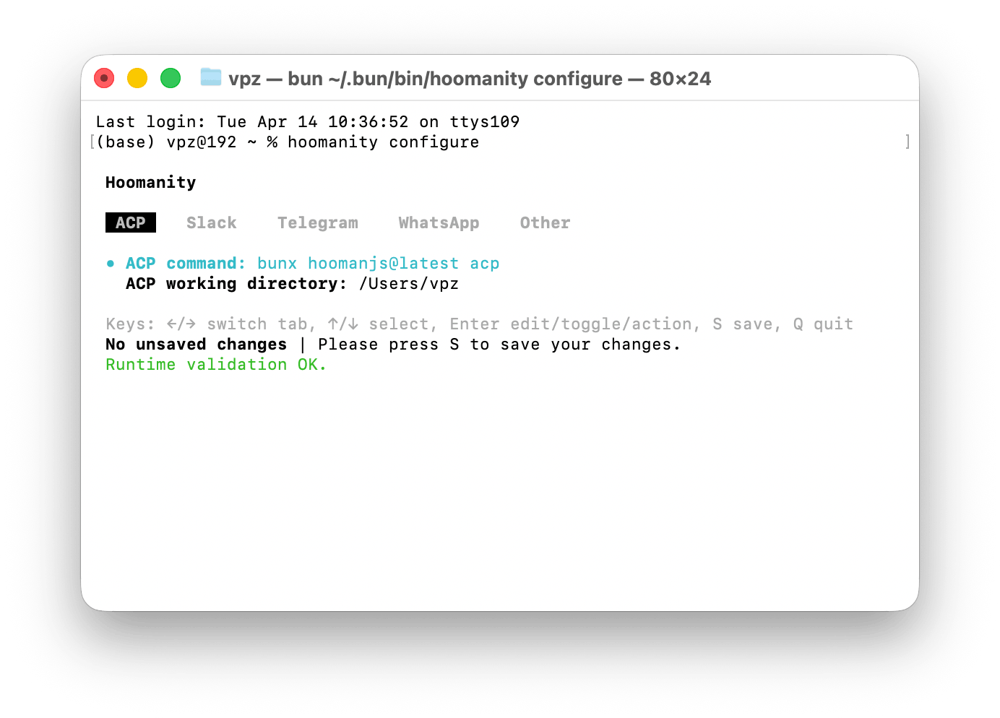

<div align="center">
  <h1>Hoomanity</h1>
  <p>
    Hoomanity is a Bun-powered ACP relay that lets you use your existing coding agents, or run your own local agents, from Slack, Telegram, and WhatsApp with persistent sessions and tool approvals.
  </p>
  <p>
    <a href="https://bun.com"></a>
    <a href="https://www.typescriptlang.org/"></a>
    <a href="https://github.com/vadimdemedes/ink"></a>
    <a href="https://github.com/vaibhavpandeyvpz/hoomanity/actions/workflows/build-publish.yml"></a>
    <a href="https://github.com/vaibhavpandeyvpz/hoomanity/stargazers"></a>
    <a href="https://github.com/vaibhavpandeyvpz/hoomanity/commits/main"></a>
  </p>
  <p>
    
  </p>
</div>

Hoomanity brings your coding agents into the chat apps your team already uses. Connect an ACP-compatible agent you already run, or spin up a local one, then talk to it from Slack, Telegram, or WhatsApp with persistent sessions, tool approvals, and a polished terminal configuration UI.

If you already use tools like Cursor or OpenCode, Hoomanity gives them a chat-native front door. If you want a fully local stack, you can pair [hoomanjs](https://www.npmjs.com/package/hoomanjs) with Ollama and a model like Gemma 4, then expose that agent to your team through the messaging platforms they already live in.

## Why Hoomanity?

- Turn Slack threads, Telegram chats, and WhatsApp conversations into persistent agent sessions
- Keep tool approvals in the same chat where the work is happening
- Reuse your existing ACP-capable agent instead of building a new bot stack
- Run a private local agent setup with `hoomanjs` + Ollama if you want full control
- Keep setup lightweight with one CLI and a simple local config file

## Features

- Chat-native agent access for Slack, Telegram, and WhatsApp
- Persistent ACP sessions per conversation, so follow-up messages keep context
- Interactive terminal configuration UI built with Ink
- Approval flows routed back to each chat platform
- Media attachment capture for supported platforms
- Allowlist controls to limit which channels or chats can talk to the agent
- Local-first configuration stored in `~/.hoomanity/config.json` or `HOOMANITY_CONFIG_PATH`

## Bring Your Own Agent

Hoomanity speaks ACP, so it is designed to sit in front of an agent process you already trust.

- Existing agent workflow: point Hoomanity at an ACP-capable agent command such as the one provided by Cursor, OpenCode, or your own custom wrapper
- Local agent workflow: run [hoomanjs](https://www.npmjs.com/package/hoomanjs) against Ollama with a local model such as Gemma 4, then connect Hoomanity to that command

That means Hoomanity focuses on the messaging, session, and approval experience, while your preferred agent stack continues to handle reasoning and tool use.

## Quickstart

Hoomanity currently runs on Bun.

### Recommended: `bunx`

```bash
bunx hoomanity configure
bunx hoomanity start
```

### Also works: `npx`

If `bun` is installed on your machine and available on `PATH`, you can also run:

```bash
npx hoomanity configure
npx hoomanity start
```

## How It Works

1. Run `configure` to point Hoomanity at your ACP agent command and enable the listeners you want.
2. Save your config to `~/.hoomanity/config.json`.
3. Run `start` to connect the ACP agent and boot the enabled listeners.
4. Chat with the bot from your allowed Slack channels, Telegram chats, or WhatsApp conversations.
5. Keep long-running work in context with persistent sessions, and approve tools directly from chat when needed.

Built-in chat controls:

- `/cancel` or `/stop`: cancel in-flight work for the current conversation
- `/reset`: start a fresh session for the current conversation

## Configuration

The main config file lives at:

```bash
~/.hoomanity/config.json
```

You can override the path with:

```bash
HOOMANITY_CONFIG_PATH=/path/to/config.json
```

The configure UI is the easiest way to manage values, but environment variables can still override config values at runtime when supported.

Notable config areas:

- `acp`: the ACP command and working directory for your chosen agent runtime
- `slack`: Socket Mode app token, bot token, allowlist
- `telegram`: bot token, allowlist
- `whatsapp`: session settings, auth flow, and allowlist

Example agent choices:

- Existing setup: point `acp.cmd` to the ACP command for Cursor, OpenCode, or another compatible agent process
- Local setup: point `acp.cmd` to a local [hoomanjs](https://www.npmjs.com/package/hoomanjs) command backed by Ollama and Gemma 4

## Development

Clone the repo and install dependencies:

```bash
bun install
```

Run the interactive config UI locally:

```bash
bun run src/cli.ts configure
```

Start the app locally:

```bash
bun run src/cli.ts start
```

Useful scripts:

```bash
bun test
bunx tsc --noEmit
```

## Project Goals

Hoomanity is designed to be hackable, local-first, and friendly to open-source contributors. The goal is simple: let people use powerful local or hosted coding agents from the chat tools they already use, without giving up persistent context, approvals, or control over where the agent runs.

If you want to add a new listener, improve the configure UI, tighten platform UX, or expand attachment and approval handling, the codebase is organized around small listener modules and shared orchestration primitives.

## Contributing

Issues and pull requests are welcome. If you are adding a new platform or changing listener behavior, focused tests and clear config/docs updates go a long way.

## License

MIT. See `[LICENSE](./LICENSE)`.
